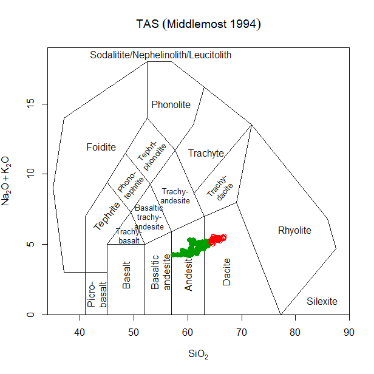

<!-- README.md is generated from README.Rmd. Please edit that file -->

# jsonGraphTemplates

<!-- badges: start -->
<!-- badges: end -->

jsonGraphTemplates allows to define templates for R graphs, using json –
a human readable format (for certain values of “human”). These templates
are primarily meant to be used with GCDkit (<http://gcdkit.org>),
although the aim is to also supply parsers to use them in ggplot and, to
a point, in base R (they will never be very good in base R, that lacks
the more advanced functionalities in paticular of calculating
combinations of variables).

## Installation

The easiest way to install jsonGraphTemplates for now is from a local
zip (or gz) file:

``` r
install.packages("jsonGraphTemplates",repo=NULL)
```

## Example

This is a basic example which shows you how to solve a common problem:

``` r
library(GCDkit)
#> Le chargement a nécessité le package : tcltk
#> Patching.... please wait
#> Entering the normal mode...
#> 
#> Initializing the EarthChem interface....
#> R proxy:  
#> System proxy:
#> Le chargement a nécessité le package : XML
#> Windows version: Windows 10 x64 (build 19045)
#> R version: x86_64-w64-mingw324.1.3
#> 
#> Geochemical Data Toolkit (GCDkit) 6.1,
#> built R 4.1.3; ; 2022-06-30 15:02:40 UTC; windows
#> 
#> Please support our efforts and cite the package 'GCDkit' in publications
#> using the reference below. Type 'citation("GCDkit")' for BibTex version.
#> ================================================================================
#> Vojtech Janousek, Colin M. Farrow and Vojtech Erban (2006).
#> Interpretation of whole-rock geochemical data in igneous geochemistry:
#> introducing Geochemical Data Toolkit (GCDkit).
#> Journal of Petrology 47(6): 1255-1259.
#> doi: 10.1093/petrology/egl013
#> ================================================================================
#> =======================================================================
#> A platform different from RGUI!
#> Still experimental...
#> =======================================================================
#> 
#> Tcl/Tk functions initialized.
#> Ready 2 Go - Enjoy!
#> 
#> Attachement du package : 'GCDkit'
#> L'objet suivant est masqué depuis 'package:graphics':
#> 
#>     plot.default
library(jsonGraphTemplates)

 data("atacazo")
 accessVar("atacazo")
#> R data 
#> ......
#> ...
#> Le chargement a nécessité le package : lattice
#> 
#>         Age (Ma) 87Sr/86Sri 143Nd/144Ndi EpsNdi   TDM TDM.Gold TDM.2stg
#> ATAC-4         0   0.704257     0.512854   4.21 0.668    0.723    0.458
#> ATAC-5         0   0.704340     0.512864   4.41 0.541    0.578    0.443
#> ATAC-16        0   0.704181     0.512873   4.58 0.639    0.693    0.429
#> ATAC-20        0   0.704223     0.512862   4.37 0.501    0.532    0.446
#> ATAC-23        0   0.704221     0.512858   4.29 0.490    0.520    0.452
#> ATAC-24        0   0.704096     0.512887   4.86 0.569    0.613    0.407
#> ATAC-27        0   0.704347     0.512834   3.82 0.713    0.772    0.489
#> ATAC-29        0   0.704372     0.512820   3.55 0.824    0.900    0.510
#> ATAC-35        0         NA     0.512828   3.71 0.679    0.732    0.498
#> ATAC-40        0   0.704313     0.512828   3.71 0.630    0.674    0.498
#> ATAC-46        0   0.704270     0.512852   4.17 0.635    0.684    0.461
#> ATAC-50        0         NA     0.512882   4.76 0.572    0.617    0.415
#> ATAC-56        0   0.704281     0.512845   4.04 0.543    0.578    0.472
#> NINA-1         0   0.704280     0.512853   4.19 0.646    0.697    0.460
#> NINA-2         0   0.704165     0.512886   4.84 0.546    0.587    0.409
#> NINA-7         0   0.704166     0.512888   4.88 0.516    0.553    0.406
#> NINA-22        0   0.704155     0.512885   4.82 0.496    0.529    0.410
#> NINA-27        0         NA     0.512840   3.94 0.575    0.614    0.480
#> NINA-34        0   0.704204     0.512894   4.99 0.565    0.610    0.396
#> NINA-37        0   0.704190     0.512880   4.72 0.596    0.643    0.418
#> NINA-47        0   0.704272     0.512840   3.94 0.583    0.623    0.480
#> NINA-49        0   0.704291     0.512889   4.90 0.589    0.638    0.404
#> NINA-52        0   0.704250     0.512890   4.92 0.566    0.610    0.403
#> NINA-53        0   0.704318     0.512880   4.72 0.482    0.513    0.418
#> WARNING: Skipping: Not sufficent REE data present!  
#> Processing...Please wait...
#> Identifying the data types present...
#> Major elements
#> ......... done!
#> Trace elements 
#> ......... done!
#> Sr and/or Nd isotopes
#> ......... done!
#> Available datasets:
#> [1] "atacazo"

plotDiagram_json("TASMiddlemostVolc.json")
```



<!-- devtools::build_readme() -->
